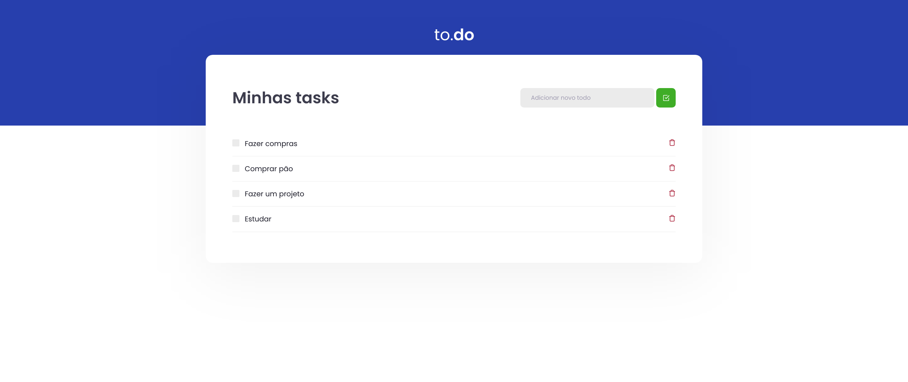

# To Do



> Nesse desafio, você deverá criar uma aplicação para treinar o que aprendeu até agora no ReactJS. Essa será uma aplicação onde o seu principal objetivo é uma pequena aplicação de atividades a fazer, para treinar um pouco mais sobre manipulação do estado no React.

## 💻 Pré-requisitos

Antes de começar, verifique se você atendeu aos seguintes requisitos:

<!---Estes são apenas requisitos de exemplo. Adicionar, duplicar ou remover conforme necessário--->

- Você instalou a versão mais recente do `< node / npm ou yarn >`
- Você tem uma máquina `< Windows / Linux / Mac >`.

## 🚀 Instalando o projeto na sua maquina

Para instalar o projeto, siga estas etapas:

Linux e macOS:

```bash
git clone https://github.com/alextfonseca/desafio01-trilha-react.js.git

$ cd desafio01-trilha-react.js

$ yarn install ou npm install

$ yarn dev ou npm dev
```

Windows:

```bash
git clone https://github.com/alextfonseca/desafio01-trilha-react.js.git

$ cd desafio01-trilha-react.js

$ yarn install ou npm install

$ yarn dev ou npm dev
```

## 🧾 Usando o projeto

Com esse projeto você pode criar uma lista de coisas que devem ser feitas, marcar como feita ou excluir a tarefa:

# <a href="https://github.com/alextfonseca/desafio01-trilha-react.js">Acesse o projeto</a>

## 😄 Me siga nas redes sociais<br>

<p align="left">

  <a href="https://www.linkedin.com/in/alex-teixeira-da-fonseca-5a99931a2/" alt="Linkedin">
  </a>

  <a href="https://wa.me/+5511976184659?text=Olá%20Alex" alt="WhatsApp">
  </a>

  <a href="https://www.instagram.com/devalextf/?hl=pt-br" alt="Instagram">
  </a>
</p>
